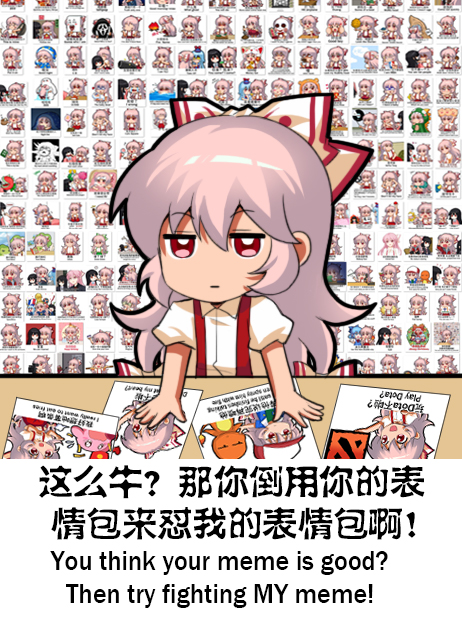
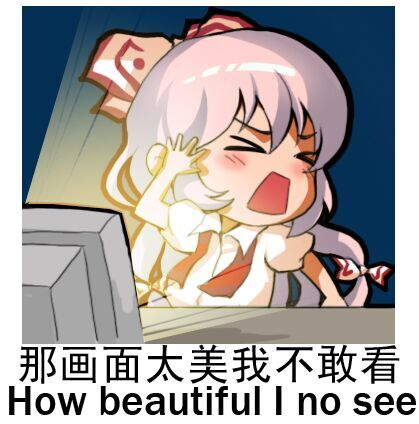
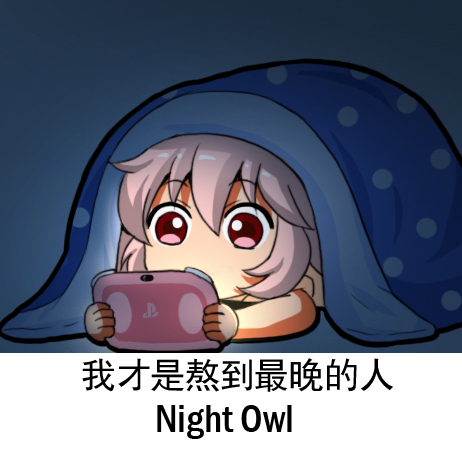

# Emoting Mokou

An app for tweeting \"Emoting Mokou\" memes. Emoting Mokou is a collection of images featuring the character Mokou from Touhou, Japanese video game series, with Chinese and \"Engrish\" captions, created by the artist Shangguan Feiying.

## Features

- [Login with Twitter](https://twitter.com/)
- [Search emotes](#search)
- [Boomark favorite emotes](#bookmark)
- [Light and dark mode](#dark)
- [Tweet emotes](#tweet)

### Search emotes 

Search and explore a database of 500+ emotes and more to come
 

 
 

### Boomark favorite emotes 

Quickly access your favorite emotes
 

 
 

### Light and dark mode 

Switch between light and dark mode
 

 
 

### Tweet emotes 

Compose a tweet with a message and up to 4 emotes
 

 
 

## Credit

[Shangguan Feiying @Jokanhiyou - Creator of Emoting Mokou meme](https://twitter.com/jokanhiyou)
